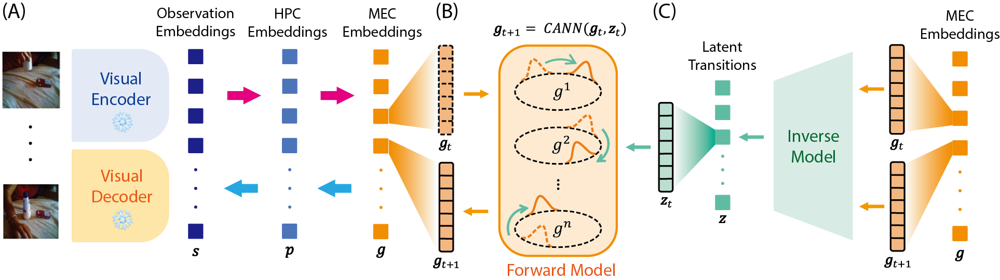

# Code for ICML 2026 paper "Structure Abstraction and Generalization in a Hippocampal-Entorhinal Inspired World Model"

<p align="center">
  <a href="https://hpc-mec-worldmodel.github.io/"></a>
  <a href="https://arxiv.org/abs/2605.15733"></a>
  <a href="https://huggingface.co/senngadaisuki/hpc-mec-worldmodel"></a>
  <a href="https://huggingface.co/datasets/senngadaisuki/omni-primitive-transforms"></a>
</p>

<p align="center">
  <a href="https://ztqakita.github.io/">Tianqiu Zhang</a><sup>*</sup> &nbsp;·&nbsp;
  Muyang Lyu<sup>*</sup> &nbsp;·&nbsp;
  Xiao Liu &nbsp;·&nbsp;
  <a href="https://www.psy.pku.edu.cn/english/people/faculty/professor/wusi/index.htm">Si Wu</a>
</p>
<p align="center">Peking University &nbsp;·&nbsp; HHMI Janelia Research Campus</p>
<p align="center"><sup>*</sup> Equal contribution</p>

<p align="center">
  
</p>
<p align="center">
  <em>Hierarchical HPC–MEC world model: (A) visual encoder/decoder with HPC and MEC
  embeddings, (B) CANN-based forward model with velocity-like path integration,
  (C) inverse model extracting content-free latent transitions.</em>
</p>

---

## Overview

A hippocampal-entorhinal inspired world model for learning reusable transition
structures from observation-only videos. The model **dissociates visual content
from abstract dynamics**, then uses velocity-like latent transitions for
prediction and zero-shot structural transfer across objects and scenes.

- **HPC** (hippocampus) binds content-rich episodic scene representations.
- **MEC** (medial entorhinal cortex) maintains compact relational structure and performs CANN-inspired path integration.
- **Inverse model** infers low-dimensional, content-free latent transitions between consecutive MEC states.

Video frames are embedded with a pretrained multi-scale VQ-VAE (from
[VAR](https://github.com/FoundationVision/VAR)). Training proceeds in 3 phases:
Phase 1 (HPC-MEC representation learning) -> Phase 2 (latent transition learning) -> Phase 3 (end-to-end finetuning).

> See the [paper](https://arxiv.org/abs/2605.15733) and the
> [project page](https://hpc-mec-worldmodel.github.io/) for the full method and results.

---

## Installation

### 1. Clone this repository

```bash
git clone https://github.com/senngadaisuki/hpc-mec-worldmodel
cd hpc-mec-worldmodel
```

### 2. Set up the environment

```bash
conda create -n hpc-mec python=3.10 -y
conda activate hpc-mec

pip install -r requirements.txt
```

### 3. Get the VAR backbone

This project depends on [FoundationVision/VAR](https://github.com/FoundationVision/VAR)
for the VQ-VAE tokenizer (`build_vae_var`, `normalize_01_into_pm1`).

```bash
git clone https://github.com/FoundationVision/VAR
```

Place the cloned repository as `VAR/` at the repository root (next to `train.py`);
it is imported directly via `from VAR.models import build_vae_var`.

Then download the VQ-VAE tokenizer checkpoint into `VAR/checkpoints/`:

```bash
mkdir -p VAR/checkpoints
wget -P VAR/checkpoints https://huggingface.co/FoundationVision/var/resolve/main/vae_ch160v4096z32.pth
```

This checkpoint (`vae_ch160v4096z32.pth`) is also downloaded automatically into
`VAR/checkpoints/` on the first run of `train.py` / `test.py`, so this manual
step is optional. (Only the VQ-VAE tokenizer is needed — `var_d16.pth` is **not**
required.)

> **Run all scripts from the repository root** (the directory containing `train.py`)
> so the relative `VAR/checkpoints/...` paths resolve correctly.

---

## Data preparation

### Something-Something-V2 (SSv2)

SSv2 is the main third-party video dataset used for training. Download and
preprocess it following the [official instructions](https://www.qualcomm.com/developer/software/something-something-v-2-dataset),
then place it under `./dataset/` (paths are configured in `train.py` / `test.py`).
For citation and dataset background, see the original
[Something-Something paper](https://arxiv.org/abs/1706.04261).

Evaluation datasets and auxiliary benchmarks are described in the
[Evaluation](#evaluation) section.

---

## Checkpoints

Pretrained weights: https://huggingface.co/senngadaisuki/hpc-mec-worldmodel

```bash
huggingface-cli download senngadaisuki/hpc-mec-worldmodel \
  --local-dir ./checkpoints
```

---

## Training

Training uses 🤗 `accelerate` (multi-GPU / mixed precision) and is split into 3 phases.

```bash
# One-time accelerate setup (multi-GPU / mixed precision)
accelerate config
```

```bash
# Phase 1 — train HPC + MEC encoding & decoding
accelerate launch --main_process_port 29600 train.py --phase 1 --num_epochs 10 --batch_size 32 --sliding_window 8\
  --work_dir ./checkpoints

# Phase 2 — train the inverse & transition dynamics
# With sliding_window=2, the training script uses an effective batch size of 224.
accelerate launch --main_process_port 29600 train.py --phase 2 --num_epochs 10 --batch_size 32 --sliding_window 2\
  --work_dir ./checkpoints  --model_ckpt ./checkpoints/phase1_best_model/best.pth

# Phase 3 — jointly finetune the HPC-MEC coupling model and the inverse model
accelerate launch --main_process_port 29600 train.py --phase 3 --num_epochs 10 --batch_size 32 --sliding_window 8\
  --work_dir ./checkpoints --model_ckpt ./checkpoints/phase2_best_model/best.pth
```

See `parse_args()` in [train.py](train.py) for the full list of arguments.
Checkpoints are saved as `phase{N}_best_model/best.pth` and
`phase{N}_latest_model/latest.pth`.

---

## Evaluation

### Quick test script

```bash
python test.py --model_ckpt ./checkpoints/model.pth
```

### Notebook

For interactive visualization and evaluation, run
**[`test.ipynb`](test.ipynb)**.


### Omni-Primitive-Transforms (our evaluation benchmark)

[Omni-Primitive-Transforms](https://huggingface.co/datasets/senngadaisuki/omni-primitive-transforms)
is a 3D object primitive-transformation dataset used to probe structural
generalization. It contains 3D object sequences under controlled single or
compositional primitive transformations, such as rotation, translation, and
scaling, rendered from high-quality scanned meshes from
[OmniObject3D](https://omniobject3d.github.io/) with Blender.

The Hugging Face dataset repository provides both the rendered data used in our
experiments and the rendering/generation code for creating the dataset. It is
**optional and used for evaluation only** — it is not required for SSv2 training.

```bash
huggingface-cli download senngadaisuki/omni-primitive-transforms \
  --repo-type dataset --local-dir dataset/omni-primitive-transforms
```

### Additional third-party evaluation benchmarks

Some analyses in the paper also refer to external object datasets and robot
manipulation benchmarks. Please follow the original project pages for download
instructions, licenses, and citation requirements:

- [COIL-100](https://www.cs.columbia.edu/CAVE/databases/SLAM_coil-20_coil-100/coil-100/)
  (Nene et al., 1996)
- [MIRO](https://github.com/kanezaki/MIRO/)
  (Kanezaki et al., 2018)
- [OmniObject3D](https://omniobject3d.github.io/)
  (Wu et al., 2023)
- [Franka Kitchen](https://minari.farama.org/datasets/D4RL/kitchen/)
  / D4RL Kitchen (Gupta et al., 2019; Fu et al., 2020)
- [Block Pushing](https://diffusion-policy.cs.columbia.edu/data/training/)
  (Florence et al., 2022)
- [Push-T](https://github.com/real-stanford/diffusion_policy)
  (Chi et al., 2023)
- [LIBERO-Goal](https://github.com/Lifelong-Robot-Learning/LIBERO)
  (Liu et al., 2023)

---

## Citation

```bibtex
@inproceedings{zhang2026structure,
  title = {Structure Abstraction and Generalization in a Hippocampal-Entorhinal Inspired World Model},
  author = {Zhang, Tianqiu and Lyu, Muyang and Liu, Xiao and Wu, Si},
  booktitle = {Forty-third International Conference on Machine Learning},
  year = {2026},
  url = {https://openreview.net/forum?id=AYXgo5FjYz}
}
```

---

## License

This project is released under the [MIT License](LICENSE).
